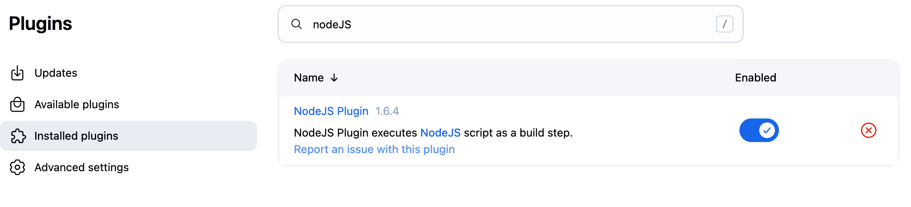
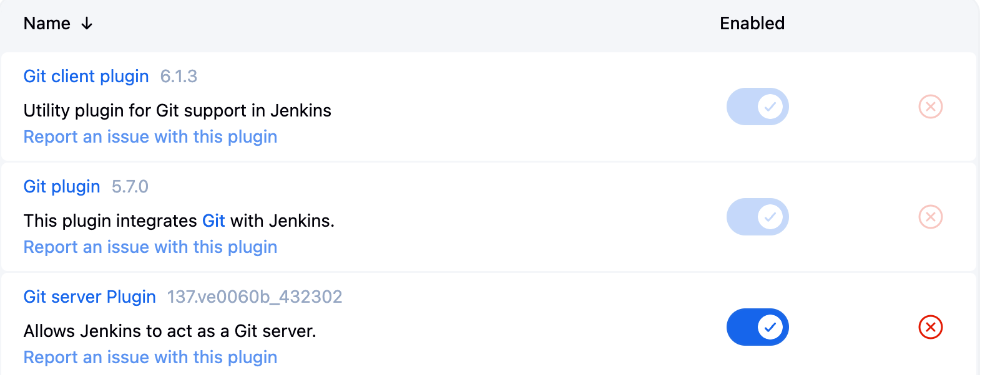
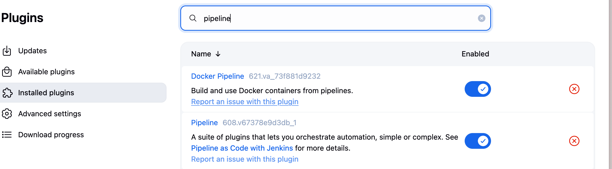
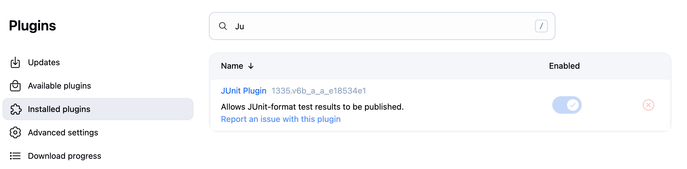
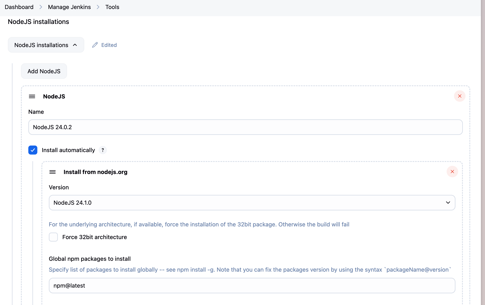
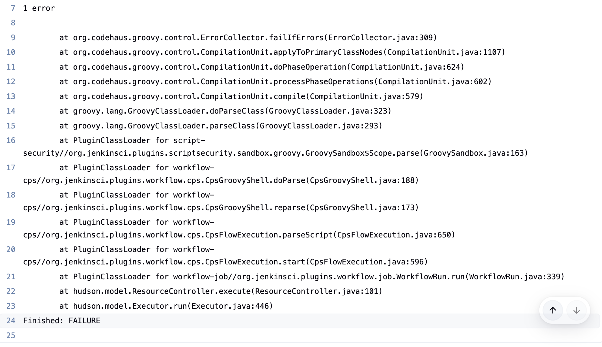
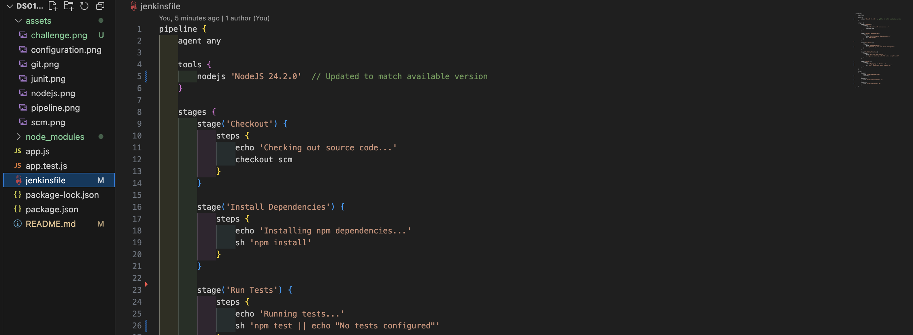
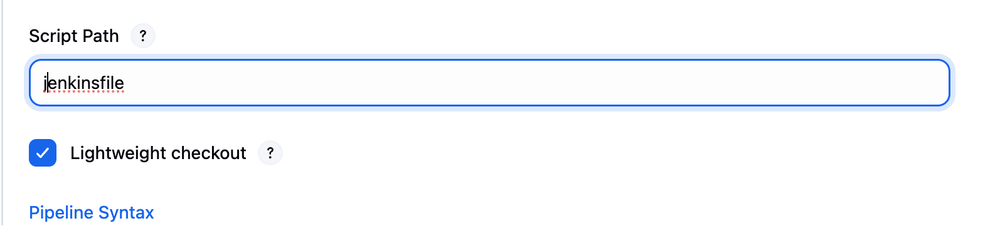
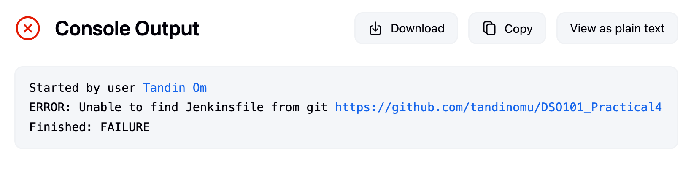

# Jenkins CI/CD Pipeline Setup

A simple guide to set up Jenkins for your Node.js project with automated testing and deployment.

## Quick Setup

### Prerequisites
- Jenkins server running
- Node.js project with Git repository
- Admin access to Jenkins

### Step 1: Install Jenkins Plugins
1. Go to **Manage Jenkins → Manage Plugins**
2. Install these plugins:
   - NodeJS Plugin
   
   - Git Plugin
   
   - Pipeline Plugin
   
   - JUnit Plugin
   


### Step 2: Configure Node.js
1. **Manage Jenkins → Global Tool Configuration**
2. Add NodeJS installation:



### Step 3: Create Jenkins Job
1. **New Item → Pipeline**
2. Configure:
   - Pipeline Definition: "Pipeline script from SCM"
   - SCM: Git
   - Repository URL: Your Git repo URL
   - Script Path: `Jenkinsfile`

### Step 4: Create Jenkinsfile
Create `Jenkinsfile` in your project root:

```groovy
pipeline {
    agent any
    
    tools {
        nodejs 'NodeJS-20.x'
    }
    
    stages {
        stage('Install') {
            steps {
                sh 'npm install'
            }
        }
        
        stage('Test') {
            steps {
                sh 'npm test'
            }
        }
        
        stage('Build') {
            steps {
                sh 'npm run build || echo "No build script"'
            }
        }
        
        stage('Deploy') {
            steps {
                sh 'echo "Deploying to staging..."'
            }
        }
    }
    
    post {
        always {
            cleanWs()
        }
    }
}
```

### Step 5: Update package.json
Make sure you have these scripts:

```json
{
  "scripts": {
    "test": "jest",
    "build": "your-build-command",
    "lint": "eslint ."
  }
}
```

### Step 6: Run Pipeline
1. Push Jenkinsfile to your Git repo
2. Click **Build Now** in Jenkins
3. Watch the pipeline run!

## Advanced Features

### Test Reporting
Add to your Jenkinsfile for test reports:

```groovy
stage('Test') {
    steps {
        sh 'npm install --save-dev jest-junit'
        sh 'npm test -- --ci --reporters=jest-junit'
    }
    post {
        always {
            junit 'junit.xml'
        }
    }
}
```

### Automatic Builds
Set up GitHub webhook:
1. GitHub repo → Settings → Webhooks
2. Add webhook: `http://your-jenkins-server/github-webhook/`
3. Jenkins job → Build Triggers → "GitHub hook trigger"

## Troubleshooting

| Problem | Solution |
|---------|----------|
| "node not found" | Check NodeJS tool name matches exactly |
| "npm test fails" | Ensure test script exists in package.json |
| "Pipeline not triggered" | Verify webhook URL and GitHub settings |
| "Permission denied" | Check Jenkins file permissions |

## File Structure
```
your-project/
├── Jenkinsfile          ← Create this file
├── package.json
├── src/
└── tests/
```

## What Happens When You Build
1. ✅ Jenkins pulls your code from Git
2. ✅ Installs npm dependencies
3. ✅ Runs your tests
4. ✅ Builds your application
5. ✅ Deploys (if configured)
6. ✅ Reports results

## Next Steps
- Add deployment scripts
- Set up notifications (Slack/email)
- Configure different environments (staging/prod)
- Add code coverage reports

---
**Need help?** Check Jenkins console output for detailed error messages.

# Challenge: Troubleshooting

## Error 1: Node.js Tool Not Found
**Console Output:**



**Fix this error.**

- Updated to the matched available version.



## Error 2: Script Path Issues



**Console Output:**


**Made changes in the pipeline script.**
